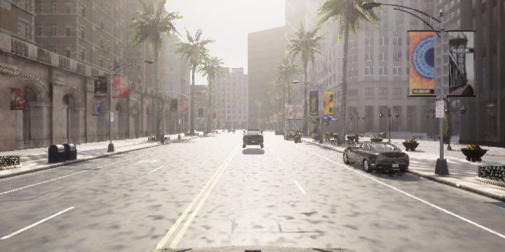

<div align="center">
  
</div>

<hr>

<div align="center"><p>
    <a href="https://github.com/command-z-z/CarlaDataCollector/stargazers">
      
    </a>
    <a href="https://github.com/command-z-z/CarlaDataCollector/pulse">
      
    </a>
    <a href="https://github.com/command-z-z/CarlaDataCollector/blob/main/LICENSE">
      
    </a>
    <a href="https://github.com/command-z-z/CarlaDataCollector/issues">
      
    </a>
</div>

> :eyes: This project is still under **development**(Beta version). I'm not an experienced carla developer. You are welcome to submit your [**PR**](https://github.com/command-z-z/CarlaDataCollector/pulls) to contribute to the community. See how to [contirbute](#-contributing).

CarlaDataCollector is a powerful tool with lightweight and clear structural designed to help users efficiently collect data in the Carla simulation environment. The framework not only provides various data collection functions but also supports exporting data to various formats to meet the diverse needs of users. With its intuitive visualization features, users can easily monitor and analyze the collected data, providing strong support for further research and experimentation.


| RGB | DEPTH |
| :-:   | :-:   |
|  |  |


## ✨ Features
- :golf: the latest CARLA 0.9.15 features.
- :key: Easily config and run your code to collect data.
- :label: Labels pre-available in multiple formats.
- :tulip: Reasonable interactions and prompts.
- :gem: Provides a variety of data processing functions.

## 💡 TODO List and ETA
- [ ] Export all data format(now only KITTI format).
- [ ] Add more data process function and different label class.
- [ ] Visualization of 2D/3D bounding boxes around agents in the simulation.
- [ ] Visualization of LiDAR point cloud (either "ray_cast or "blickfeld" ) of the world in the simulation.
 
## ⚡️ Requirements

- [CARLA](https://carla.org/) >= [0.9.15](https://github.com/carla-simulator/carla/releases/tag/0.9.15)
- Other requirement see [requirement.txt](https://github.com/command-z-z/CarlaDataCollector/blob/main/requirements.txt)

## 🎨 Example
<details>
<summary><b>KITTI-3D-lidar</b> <span style="font-size:14px;">(Click to expend) </span> </summary>

Generate simulation lidar data set in KITTI odometry dataset format based on CARLA Simulator. Use nvidia [NKSR](https://research.nvidia.com/labs/toronto-ai/NKSR/) method reconstruct mesh by lidar point cloud.
```
python generator.py --cfg_file ./configs/kitti/3d-lidar.yaml
```

| LIDAR | [NKSR](https://github.com/nv-tlabs/NKSR) |
| :-:   | :-:   |
|  |  |

You can reproduce the result from above image by following command line. More details and environment setup, please find from [NKSR](https://github.com/nv-tlabs/NKSR) repository.
```
python scripts/recon_nksr.py
```

</details>

<details>
<summary><b>KITTI-3D-object</b> <span style="font-size:14px;">(Click to expend) </span> </summary>

Generate simulation data set in KITTI 2D/3D target detection dataset format based on CARLA Simulator(Reference from [Repo](https://github.com/mmmmaomao/DataGenerator)).
```
python generator.py --cfg_file ./configs/kitti/3d-object.yaml
```


</details>

## 🚀 Usage

1. Clone the repository to your local machine

```
git clone https://github.com/command-z-z/CARLA-KITTI.git
```

2. Create client and collector customized for your own tasks:

<details>
<summary><b>Customized SynchronyClient</b> <span style="font-size:14px;">(Click to expend) </span> </summary>

Inherit the function from `BasicClient` and overload the `tick` function according to your own data collection requirements.
```python
class Client(BasicClient):
    def __init__(self, cfg):
        super().__init__(cfg)

    def tick(self):
        self.frame = self.world.tick()
        ego_vehicle, dataQue = next(iter(self.data["sensor_data"].items()))
        
        # set_spectator
        self._set_spectator(ego_vehicle)

        # set overtaking
        auto_decide_overtake_direction(ego_vehicle, self.world, self.traffic_manager)

        ret = {"actors": None, "sensors_data": {}}
        ret["actors"] = self.world.get_actors().filter('*vehicle*')

        data = [self._retrieve_data(q) for q in dataQue]
        assert all(x.frame == self.frame for x in data)

        sensors = self.actors["sensors"][ego_vehicle]
        sensor_intrinsic = [get_camera_intrinsic(int(sensor.attributes['image_size_x']), int(sensor.attributes['image_size_y']), int(sensor.attributes['fov'])) for sensor in sensors[:5]]
        sensor_extrinsic = [np.mat(sensor.get_transform().get_matrix()) for sensor in sensors]

        ret["sensors_data"][ego_vehicle] = {}
        ret["sensors_data"][ego_vehicle]["sensor_data"] = data
        ret["sensors_data"][ego_vehicle]["intrinsic"] = sensor_intrinsic
        ret["sensors_data"][ego_vehicle]["extrinsic_inv"] = sensor_extrinsic
        ret["sensors_data"][ego_vehicle]["lidar"] = sensors[5]
        return ret
```

</details>

<details>
<summary><b>Customized DataCollector</b> <span style="font-size:14px;">(Click to expend) </span> </summary>

Inherit the function from `BasicDataCollector` and overload the function according to your own data collection requirements.

```python
class DataCollector(BasicDataCollector):
    def __init__(self, cfg):
        super().__init__(cfg)
        self._generate_path()

    def _generate_path(self):
        folders = ['image', 'depth_1', 'depth_2', 'depth_3', 'depth_4', 'velodyne']

        for folder in folders:
            directory = os.path.join(self.OUTPUT_FOLDER, folder)
            if not os.path.exists(directory):
                os.makedirs(directory)

        self.LIDAR_PATH = os.path.join(self.OUTPUT_FOLDER, 'velodyne/{0:06}.bin')
        self.IMAGE_PATH = os.path.join(self.OUTPUT_FOLDER, 'image/{0:06}.png')
        self.DEPTH_1_PATH = os.path.join(self.OUTPUT_FOLDER, 'depth_1/{0:06}.png')
        self.DEPTH_2_PATH = os.path.join(self.OUTPUT_FOLDER, 'depth_2/{0:06}.png')
        self.DEPTH_3_PATH = os.path.join(self.OUTPUT_FOLDER, 'depth_3/{0:06}.png')
        self.DEPTH_4_PATH = os.path.join(self.OUTPUT_FOLDER, 'depth_4/{0:06}.png')
        self.CALIB_PATH = os.path.join(self.OUTPUT_FOLDER, 'calib.txt')
        self.POSE_PATH = os.path.join(self.OUTPUT_FOLDER, 'pose.txt')
        self.CAR_PATH = os.path.join(self.OUTPUT_FOLDER, 'ego_vehicle_trajectory.txt')
        self.BBOX_PATH = os.path.join(self.OUTPUT_FOLDER, 'bbox.txt')

    def save_training_files(self, data):

        lidar_fname = self.LIDAR_PATH.format(self.captured_frame_no)
        img_fname = self.IMAGE_PATH.format(self.captured_frame_no)
        depth_1_fname = self.DEPTH_1_PATH.format(self.captured_frame_no)
        depth_2_fname = self.DEPTH_2_PATH.format(self.captured_frame_no)
        depth_3_fname = self.DEPTH_3_PATH.format(self.captured_frame_no)
        depth_4_fname = self.DEPTH_4_PATH.format(self.captured_frame_no)
        calib_fname = self.CALIB_PATH
        pose_fname = self.POSE_PATH
        car_fname = self.CAR_PATH
        bbox_frname = self.BBOX_PATH


        ego_vehicle, dt = next(iter(data["sensors_data"].items()))
        save_calibration_data(calib_fname, dt["intrinsic"], dt["extrinsic_inv"])
        save_image_data(img_fname, dt["sensor_data"][0])
        save_depth_data(depth_1_fname, dt["sensor_data"][1])
        save_depth_data(depth_2_fname, dt["sensor_data"][2])
        save_depth_data(depth_3_fname, dt["sensor_data"][3])
        save_depth_data(depth_4_fname, dt["sensor_data"][4])
        save_lidar_data(lidar_fname, dt["sensor_data"][5])
        save_ego_vehicle_trajectory(car_fname, ego_vehicle)
        save_pose_data(pose_fname, dt["lidar"])
        save_npc_data(bbox_frname, data["actors"], ego_vehicle)
        self.captured_frame_no += 1
```

</details>

3. Write your [config file](#-configuration) and provide the data required for data collection (e.g. sensors, ego_vehicle etc)

## 🪓 Configuration

You can inherit this [basic.yaml](https://github.com/command-z-z/CarlaDataCollector/blob/main/configs/basic.yaml) by `parent_cfg` parameter and then add or modify some parameters you want.The basic configuration file is as follows:

```yaml
# Base task or scenario type for the simulation
task: base

# Name of the experiment or simulation run
exp_name: '3d-object'

# Map used in the simulation
map: 'Town10HD_Opt'

# Module used for data collection
collector_module: lib.collectors.Basic

# Module for the simulation client
client_module: lib.clients.Basic

# CARLA simulator specific configurations
carla:
    client:
        # Server host address for the CARLA server
        host: 'localhost'
        # Port number for connecting to the CARLA server
        port: 2000
    # Weather condition in the simulation
    weather: WetNoon
    # Time step in seconds for the simulation
    fixed_delta_seconds: 0.05
    # Number of non-player character vehicles in the simulation
    num_of_npc_vehicles: 10 
    # Number of NPC pedestrians or walkers in the simulation
    num_of_npc_walkers: 20

# Configuration for the spectator viewpoint
spectator:
    transform:
        # Location coordinates of the spectator
        location: [0, 0, 20]
        # Rotation angles of the spectator camera
        rotation: [-90, 0, 0]
    
# Traffic manager configurations
traffic_manager: 
    # Port number for the traffic manager service
    port: 8000
    # Default distance to maintain from the vehicle ahead for all NPCs
    global_distance_to_leading_vehicle: 2.5 
    # Default percentage variation from the speed limit for all NPCs
    global_percentage_speed_difference: 30.0

# Configuration for the player-controlled vehicle
ego_vehicle:
    # Specifies the vehicle model, any model from the Lincoln series
    blueprint: vehicle.lincoln.*
    # Percentage chance of ignoring traffic lights, set to 0%
    ignore_lights_percentage: 0.0
    # Percentage chance of ignoring traffic signs, set to 0%
    ignore_signs_percentage: 0.0
    # Percentage chance of ignoring other vehicles, set to 0%
    ignore_vehicles_percentage: 0.0
    # Percentage chance of ignoring pedestrians, set to 0%
    ignore_walkers_percentage: 0.0
    # Percentage variation from the speed limit for the player-controlled vehicle
    vehicle_percentage_speed_difference: 30.0

# Configuration for sensors attached to the ego vehicle
sensors:
    # Configuration for the RGB camera sensor
    rgb:
        transform:
            # Location coordinates of the camera
            location: [0, 0, 1.6]
            # Rotation angles of the camera
            rotation: [0, 0, 0]
        # Specifies the sensor type as an RGB camera
        blueprint: sensor.camera.rgb
        attribute:
            # The resolution of the camera image
            image_size_x: 720
            image_size_y: 360
            # The field of view of the camera
            fov: 90

# Number of frames or iterations to run the simulation
all_frame_iter: 100
```

## 🔥 Contributing

Pull requests are welcome.

How to add a new example for CarlaDataCollector:

1. Create a customized client file in `lib/clients/` folder.

2. Create a customized collector file in `lib/collectors/` folder.

3. Create a file like `configs/basic.yaml` for specific task configuration.

4. Add the extension data process or visualization function in `lib/utils/` folder.

5. Add a description to the [Example](#-example) section of the `README.md` to let users know more about it.

## 🍺 Contact

For CarlaDataCollector bug reports and feature requests please visit [GitHub Issues](https://github.com/command-z-z/command-z-z/issues), and join our [Discord](https://discord.gg/2QGjgzgM) community for questions and discussions!
